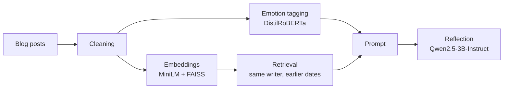

# RAG Journal Sentiment Analyzer

Retrieval-augmented reflections on personal writing. For each blog post, the pipeline detects its emotion, retrieves related earlier posts by the same writer with FAISS, and generates a short, grounded reflection with an instruction-tuned LLM.

## Pipeline



## Data

Blog Authorship Corpus (Kaggle, `rtatman/blog-authorship-corpus`), downloaded with `kagglehub`. A sample of 500 bloggers with 30+ posts each, capped at 100 posts per blogger: **27,999 posts** with real dates and writer IDs. Each writer gets their own FAISS index, so retrieval only ever searches that writer's posts.


## Design choices

- **Same-writer, strictly-earlier retrieval.** A post can only retrieve the same blogger's posts from earlier dates, so reflections never draw on other people or on the future.
- **Similarity threshold (0.45).** Weak matches are dropped. If nothing qualifies, the prompt tells the model to focus only on today.
- **Grounded prompting.** Second-person voice, 2-3 sentences, no invented past events, and a fallback for posts that aren't personal (jokes, news, lyrics).

## Results

| Metric | Result |
|---|---|
| Emotion agreement, retrieved past posts | 0.319 |
| Emotion agreement, random past posts (same writer) | 0.260 |
| Queries evaluated | 13,357 |
| Retrieval coverage (100 sampled posts) | 45% |
| Copy rate, FLAN-T5 (initial tests, 20 samples) | 90% |
| Copy rate, Qwen2.5-3B-Instruct (100 posts) | 0% |
| Invented past events when nothing was retrieved | 0 of 55 |
| First-person voice slips | 4 of 100 |

Copy rate is the share of reflections where more than 50% of 5-word sequences appear verbatim in the post or retrieved posts.

## Threshold analysis (50-blogger sample)

| MIN_SIM | Queries with retrieval | Retrieved | Random | Gap | Relative lift |
|---|---|---|---|---|---|
| 0.40 | 1,418 | 0.348 | 0.297 | 5.1 pts | 17% |
| **0.45** | 1,192 | 0.373 | 0.309 | 6.4 pts | **21%** |

0.45 was chosen for higher retrieval precision. Empty retrievals are handled safely by the prompt, while weak matches push the model to force connections that aren't there. Scaling to 500 bloggers kept the lift at 23%.

## Key findings

- Retrieval beats a same-writer random baseline by 5.9 points (about 23% relative) across 13,357 queries, even though a writer's posts already resemble each other.
- FLAN-T5 mostly copied its input back. An instruction-tuned chat model removed copying entirely.
- Dropping the "past entries" section from the prompt when nothing is retrieved stopped the model from inventing a history.

## Limitations

- The emotion model was trained on short text, so labels are noisy on long or sarcastic posts, which caps the agreement scores.
- About a quarter of reflections still open with "Reflecting on...", a stylistic habit of the model.
- Blog dates are coarse, so same-day posts are excluded from retrieval.
- The corpus is from 2004, and many writers are teenagers.

## Running it

Open `notebooks/rag_sentiment_analyzer.ipynb` in Google Colab with a T4 GPU and run all cells. The dataset downloads automatically.

```bash
pip install -r requirements.txt
```

## Repository structure

```
notebooks/rag_sentiment_analyzer.ipynb   full pipeline
reports/sample_report.txt                100 generated reflections
requirements.txt
README.md
```
